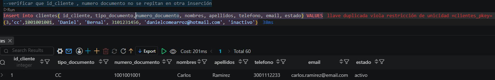
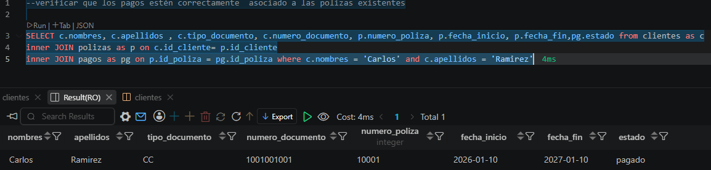

# lectura de ISTQB

## Niveles de prueba y tipos de prueba

## objetivo 
Comprender cómo se organizan las pruebas según el nivel del sistema evaluado y según el proposito de la prueba

### Prueba de componente
También conocida como prueba unitaria se centra en probar componentes de manera aisladas, lo que requiere un soporte
especifico o marcos de trabajo para la prueba unitaria.

### Prueba de integración componentes
prueba de integración de unidades se concentra en probar la interfaces y las interacciones entre componentes depende de
gran medida de los enfoques de la estrategia de integración, como ascendente, descendente o bingbang

### prueba de sistema

se concreta en el comportamiento general y las capacidades de todo un sistema o producto, incluyendo a menudo la prueba 
funcional de las caracteristicas de calidad

[Evidencia](prueba-sistema.md)

### prueba de integración de sistemas
se concentra en probar las interfaces del sistema sujeto a prueba y otros sistemas y servicios externos, lo cual requiere
entornos de prueba adcuados

[Evidencia](prueba-integracion-sistema.md)

### Prueba de aceptación
se concentra en la validación y en demostrar la preparación para el despliegue, lo que significa que el sistema satisface las necesidades del negocio 
del usuario principales formas de prueba:
1. Prueba de aceptación de usuario (PAU)
2. prueba de aceptacion operativa
3. prueba de aceptación contractual y de regulación
4. prueba alfa y beta

Los niveles de prueba se distinguen:
* objeto de prueba
* obetivos de prueba
* base de prueba
* defectos y falllos
* enfoque y responsabilidad

#### Tipos de pruebas
1. prueba funcional: evalúa funciones que debe realizar un componente o sistema. Las funciones son aquello que se debe hacer el objeto de prueba, su principal objetivo 
es comprobar la completitud funcional, la correccion funcional y la pertinencia funcional

2. Prueba no funcional: evalúa atributos distintos a las caracteristicas funcionales de un componente o sistema, por lo tanto es la comprobación de lo bien que se comporta
el sistema como:
* eficiencia y desempeño
* compatibilidad
* fiabilidad
* seguridad
* mantenibilidad
* portabilidad

## Prueba de caja negra

Se basa en la especificación y obtiene pruebas a partir de la documentación externa al objeto de prueba donde el objetivo principal  de la prueba es comprobar
el comportamiento del sistema frente a sus especificaciones

- [Prueba de caja negra - Registro de pago](prueba-caja-negra.md)

## Prueba de caja blanca
se basa en la estructura y obtiene pruebas de la implementación o la estructura interna del sistema como:
1. codigo
2. arquitectura
3. flujos de trabajo
4. flujos de datos

- [ Prueba de caja blanca](caja-blanca.md)