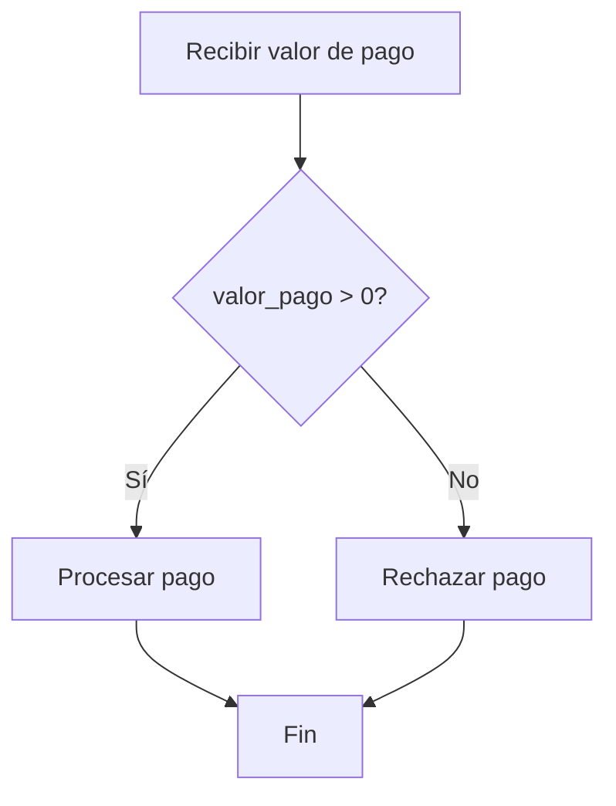

# Prueba de caja blanca - Validación de valor de pago

## Objetivo

Validar las rutas internas de decisión utilizadas para procesar el valor de un pago.

## Lógica evaluada

```text
Si valor_pago > 0
    Pago válido

Si valor_pago <= 0
    Pago inválido
```

## Diagrama de flujo

