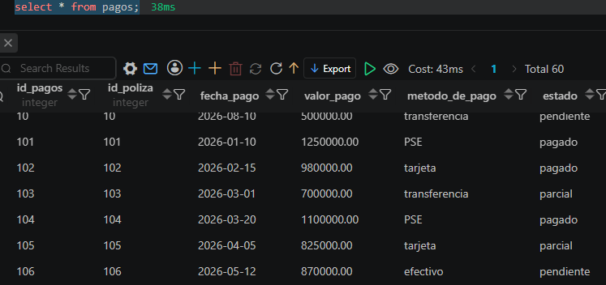
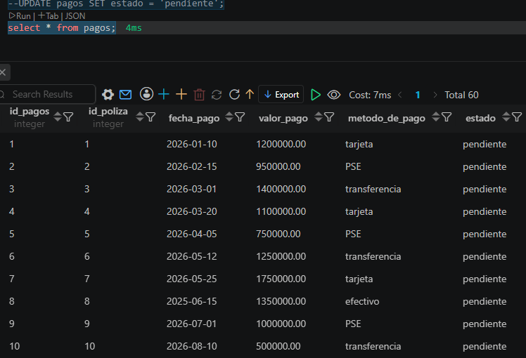

# Evidencia CRUD - UPDATE

## Objetivo
Validar la modificación controlada de un registro existente.

## Riesgo principal
Ejecutar UPDATE sin WHERE puede modificar todos los registros de una tabla.

## Estrategia de validación

Antes de ejecutar la modificación, se valida el registro objetivo mediante SELECT.

## Resultado esperado
Únicamente el registro seleccionado debe cambiar.

## Evidencia
- Consulta SQL ejecutada.

- Resultado obtenido.
